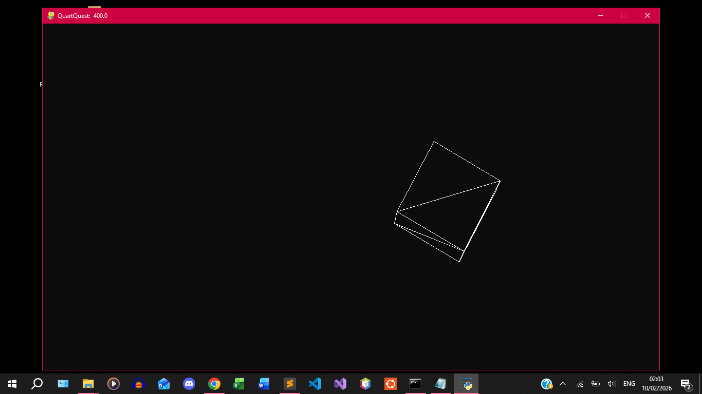
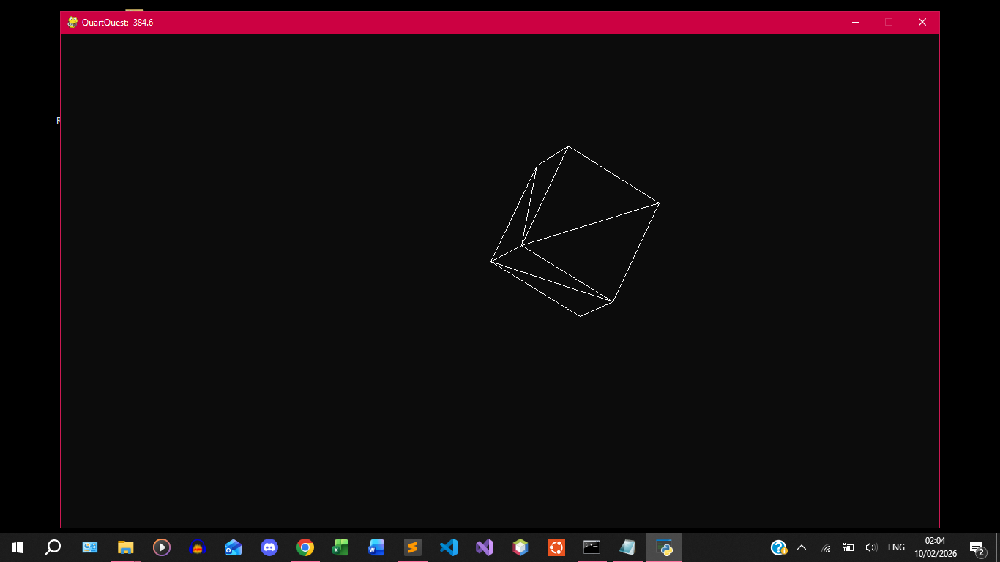
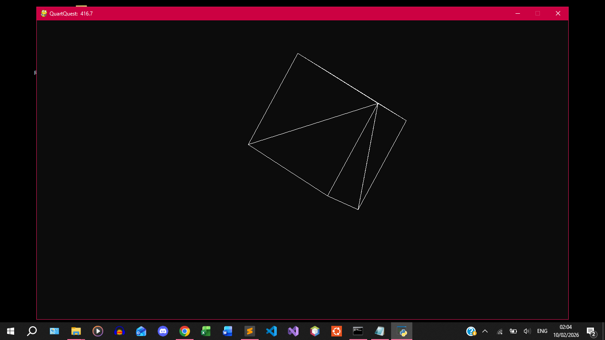
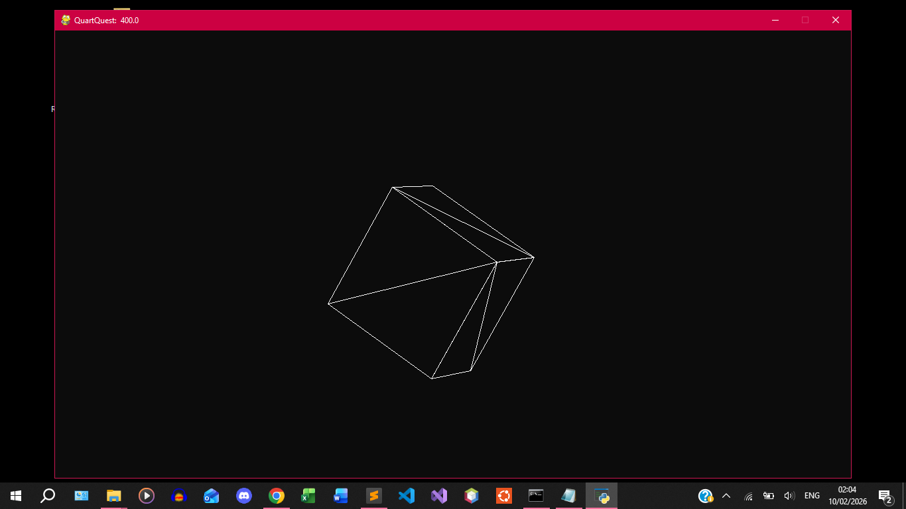
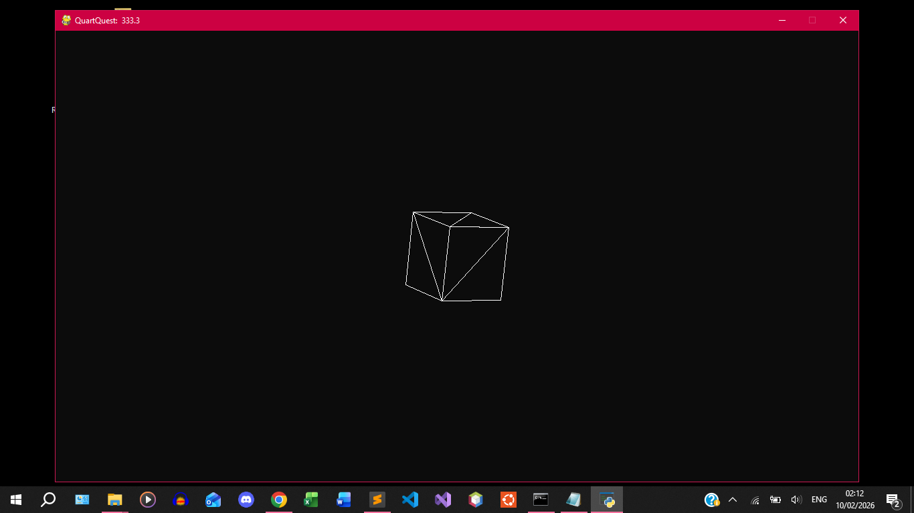

#	QuartCube


###	Why
Exploring Controlling a 3D Cube with Quaternions

###	What
+	Initially planned to consist of two main methods for rendering the Cube.
+	Each method demonstrates a unique way of drawing the 3D Cube:
	1.	CPU-only
	2.	with GPU
+	Managed to render Cube with CPU only
+	Managed to setup framework for manipulating view of cube using keys and mouse.
+	The afore-mentioned framework involves the use of a Camera, and hence a View Matrxi, and a Projection Matrix.
+	Cameras:
	*	Two Types were created:
		1.	First Person Shooter-like camera
		2.	Key-Controlled Look At Direction Camera.
+	Explored affine transformation matrices, both row-vector-compatible types and theur major-vector-compatible counterparts. 
+	Implemented rotating cube around its axis (with functionality of rotating about custom axes), using Eulclidean methods. Implemented conditions against Gimbal lock.
+	Implemented rotating cube around its axis (and custom axes) using quaternions. This method is immune to Gimbal lock. 
+	To demonstrate rotating Cube using quaternions, the Key-Controlled Look At Direction Camera was used. The quaternions were used to modify the cube's orientation in real-time.
+	The methods utilizing just Euclidean formulas where used to predefine the cube's orientaion before rendering.

###	Setup
1.	Create and activate virtual environment (Windows):
	*	Create:	`python -m venv <your_virtual_environment>`
		-	replace '<your_virtual_environment>' with the name of your environment
	*	Activate: `<your_virtual_environment>/Scripts/activate.bat`.

2. Install requirements: `pip install -r requirements.txt`

3.	In directory with file `main.py`. Run, `python main.py`


4.  Run Different Cases:
    -   In the file './CpuCore/cpu_core.py', you'll see these lines of code:
    ```python
        # self.fc = FirstCube(self.eng)
        # self.qc = QuartCube(self.eng)
        self.qc2 = QuartCube2(self.eng)
        # self.lc = LastCube(self.eng)
        self.eng.program = self.qc2
    ```
    -   To test the different Test Cases, uncomment a single of the cases between these:
        +   `self.fc`, `self.qc`, `self.qc2`, `self.l`
        	*	`self.lc` is a correction of `self.fc` that demonstrates the FPS Camera and initial rotation and translation of cube.
        	*	`self.qc2` is like that of `self.qc`, but uses an improved/more efficient method for quaternion rotation.
        		*	The former uses a better method that directly calculates the new quaternions from product of rotation quaternions about different axes, and then directly multiplying the resulting quaternion with the 3D point to transform it.
        		*	In contrast, the latter uses a previous method that first converts each quaternion into its corresponding rotation matrix, then multiplying the matrices into the final matrix, and using that matrix to convert the Cube's Model Matrix which is then used in the rendering call (the `draw` method) to modify the Cube's points in real-time. 
        +   Then change which of those chosen above (by uncommenting) to be assigned to `self.eng.program`.
            *   Currently, `self.qc2` is assigned to it.
            *   Change that to be the name of whichever you want to test.
>	Notice that the mouse is hidden. And from tinkering, you'll see that its
	regularly repositioned to be in the centre.
>    Used the chance to practice Git Hooks.

###	Screenshots









